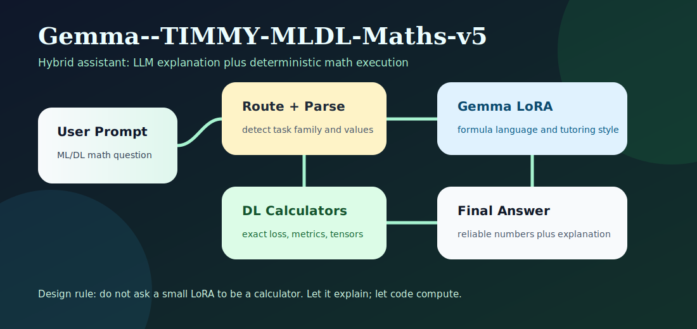
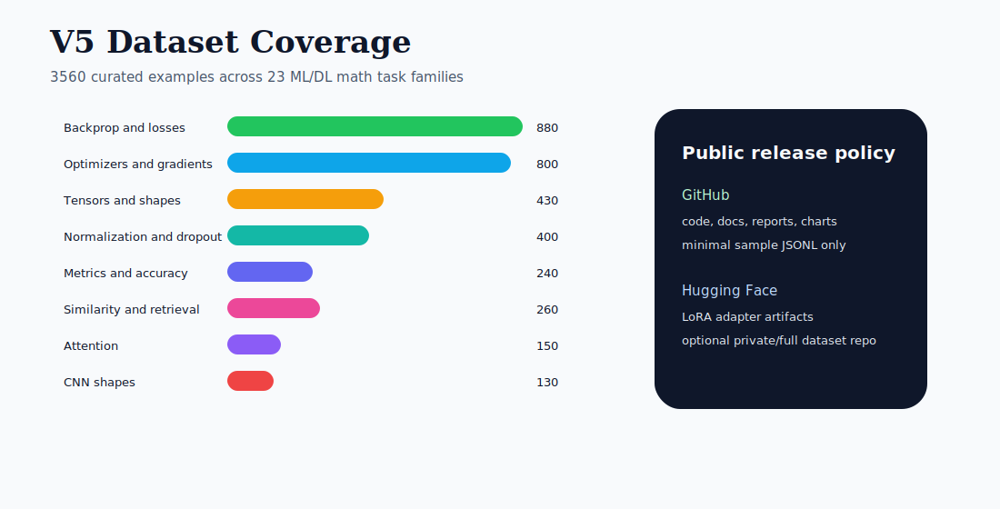
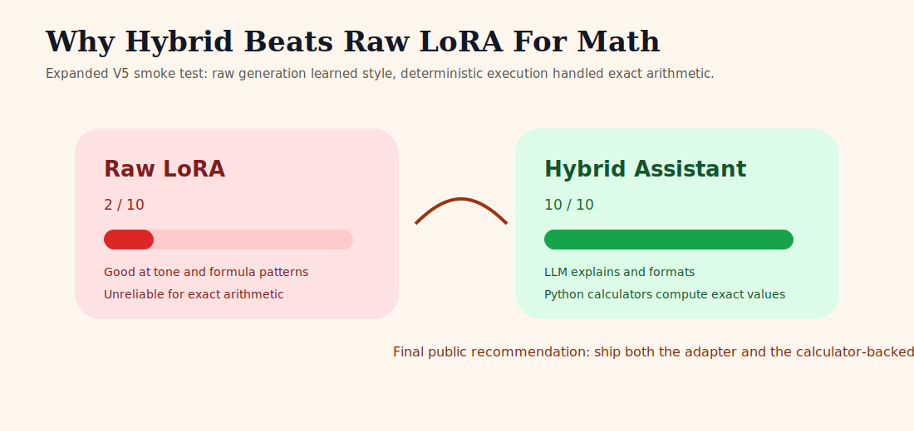

# Gemma--TIMMY-MLDL-Maths-v5

Gemma--TIMMY-MLDL-Maths-v5 is a local math assistant project focused on machine-learning and deep-learning calculations. It combines a fine-tuned Gemma LoRA adapter with deterministic Python calculators so the assistant can explain math clearly while still returning reliable numeric results.

The important design decision is simple: **the LLM explains, the calculators compute**. Raw small-model LoRA adapters are useful for tone, formulas, and tutoring flow, but they are not dependable calculators. This repo therefore ships the hybrid path as the recommended public interface.



## What We Built

- A curated V5 synthetic training set covering ML/DL math operations.
- A Gemma 2 2B LoRA adapter trained locally with Unsloth on an RTX 3050 8GB.
- Deterministic calculators for exact math tasks such as cross entropy, backprop, metrics, gradient descent, tensor shapes, cosine similarity, and semantic-search scoring.
- Evaluation reports showing why raw LoRA alone is not enough for exact arithmetic.
- Minimal public sample data only. The full generated dataset is intentionally not committed to GitHub.

## Current V5 Coverage



The V5 dataset covers these task families:

- sigmoid + binary cross entropy backprop
- binary cross entropy from probabilities
- softmax cross entropy and logit gradients
- ReLU MLP backprop and linear MSE backprop
- vanilla gradient descent, momentum SGD, Adam, and weight-decay SGD
- gradient clipping
- activation derivatives
- BatchNorm, LayerNorm, and inverted dropout
- CNN output shapes
- scaled dot-product attention
- matrix multiplication and tensor matmul shapes
- tensor broadcasting shapes
- binary classification metrics
- multiclass accuracy
- cosine similarity
- semantic-search ranking with embedding cosine scores

## Why Hybrid



The expanded raw LoRA learned the answer style and formula structure, but exact arithmetic remained unreliable. The deterministic calculator-backed assistant scored correctly on the expanded benchmark because it computes values directly instead of relying on generated arithmetic.

Recommended usage:

```text
User prompt -> deterministic calculator route -> formatted answer
            -> fallback to Gemma LoRA for explanation or unsupported tasks
```

## Repository Contents

```text
.
├── assets/
│   ├── architecture.svg
│   ├── dataset_coverage.svg
│   └── reliability_comparison.svg
├── docs/
│   ├── DATASET_CARD.md
│   ├── MODEL_CARD.md
│   └── RELEASE_NOTES.md
├── samples/
│   └── v5_dl_min_sample.jsonl
├── dl_calculators.py
├── einstein_dl_hybrid_assistant.py
├── einstein_hybrid_assistant.py
├── generate_v5_dl_dataset.py
├── math_calculators.py
├── train_gemma_unsloth.py
├── test_finetuned_math_assistant.py
├── check_gpu_torch.py
└── requirements.txt
```

GitHub intentionally excludes:

- `.env`
- virtual environments
- Unsloth compiled caches
- full training data
- model checkpoints and adapter weights
- local Hugging Face or Ollama caches

## Quick Start

Install dependencies in a CUDA-enabled Python environment:

```powershell
python -m pip install -r requirements.txt
```

Check GPU visibility:

```powershell
python check_gpu_torch.py
```

Run the deterministic DL hybrid assistant:

```powershell
python einstein_dl_hybrid_assistant.py --question "Softmax cross entropy: logits=[2.0, 1.0, 0.1], true_class=0. Compute probabilities, loss, and dL/dlogits."
```

Example output:

```text
probabilities=[0.659, 0.2424, 0.0986], loss=0.417, dL/dlogits=[-0.341, 0.2424, 0.0986]
```

Run a semantic-search math example:

```powershell
python einstein_dl_hybrid_assistant.py --question "Semantic search: query_embedding=[1.0,0.0], document_embeddings=[[0.9,0.1],[0.0,1.0],[0.7,0.7]]. Rank documents by cosine similarity."
```

Expected result:

```text
best_document_index=0, cosine_scores=[0.9939, 0, 0.7071]
```

## Training Summary

- Base model: `unsloth/gemma-2-2b-it-bnb-4bit`
- Adapter name: `Gemma--TIMMY-MLDL-Maths-v5`
- Training examples: `3560`
- Eval examples: `16`
- Training steps: `450`
- Final training loss: approximately `0.274`
- Hardware: NVIDIA RTX 3050 8GB
- Training framework: Unsloth

The expanded adapter is intended to be released on Hugging Face. GitHub contains only source code, reports, visuals, and minimal sample data.

## Recreate The Dataset

The generator is included for reproducibility, but the full generated dataset is not committed.

```powershell
python generate_v5_dl_dataset.py
```

This writes:

```text
outputs/v5/data/v5_dl_train_chat.jsonl
outputs/v5/data/v5_dl_eval_cases.jsonl
outputs/v5/reports/v5_dl_dataset_report.md
```

Only [samples/v5_dl_min_sample.jsonl](samples/v5_dl_min_sample.jsonl) is included publicly.

## Train The Adapter

Example local training command:

```powershell
$env:UNSLOTH_BASE_MODEL="unsloth/gemma-2-2b-it-bnb-4bit"
$env:UNSLOTH_TRAIN_DATA="outputs/v5/data/v5_dl_train_chat.jsonl"
$env:UNSLOTH_TRAIN_FORMAT="chat"
$env:UNSLOTH_OUTPUT_DIR="outputs/v5/models/gemma_dl_lora_expanded"
$env:UNSLOTH_MAX_SEQ_LENGTH="1024"
$env:UNSLOTH_MAX_STEPS="450"
$env:TORCHDYNAMO_DISABLE="1"
python train_gemma_unsloth.py
```

## Limitations

- The raw LoRA adapter should not be treated as a standalone calculator.
- Exact numeric answers should use `einstein_dl_hybrid_assistant.py` or another deterministic execution layer.
- The included dataset is synthetic and should be independently validated before use in safety-critical workflows.
- This project is educational/research software, not financial, legal, or safety-critical engineering advice.

## License

Code and documentation are released under the MIT License. The Gemma base model and any derived adapter usage remain subject to the applicable Google Gemma and Hugging Face model terms.
