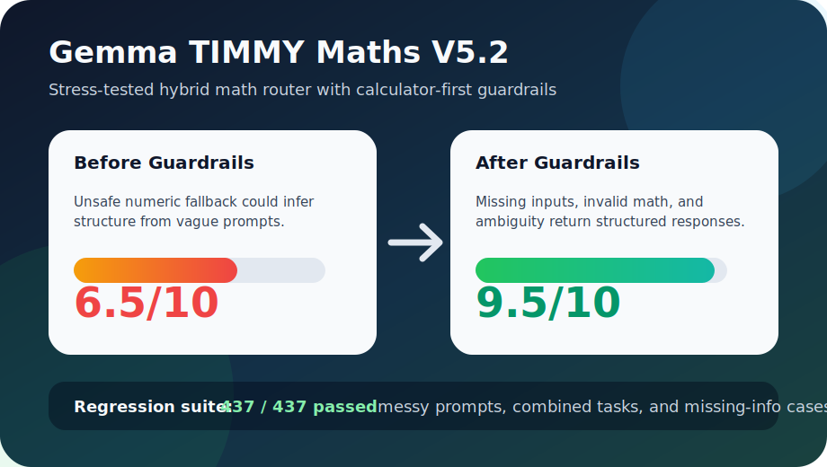

# Gemma--TIMMY-MLDL-Maths-v5

Gemma--TIMMY-MLDL-Maths-v5 is a local math assistant project focused on machine-learning, deep-learning, statistics, forecasting, trading indicators, portfolio math, and vector/kinematics calculations. It combines a fine-tuned Gemma LoRA adapter with deterministic Python calculators so the assistant can explain math clearly while still returning reliable numeric results.

The important design decision is simple: **the LLM explains, the calculators compute**. Raw small-model LoRA adapters are useful for tone, formulas, and tutoring flow, but they are not dependable calculators. This repo therefore ships the hybrid path as the recommended public interface.


## What We Built

- A curated V5 synthetic training set covering ML/DL math operations.
- A V5.2 advanced quantitative extension covering statistics, forecasting, trading indicators, portfolio math, and automotive/vector calculations.
- A Gemma 2 2B LoRA adapter trained locally with Unsloth on an RTX 3050 8GB.
- Deterministic calculators for exact math tasks such as cross entropy, backprop, metrics, gradient descent, tensor shapes, cosine similarity, semantic-search scoring, RSI, VaR, portfolio volatility, and kinematics.
- Guardrails for missing inputs, invalid inputs, ambiguous prompts, unsafe defaults, and vague numeric descriptions.
- Evaluation reports showing why raw LoRA alone is not enough for exact arithmetic.
- Minimal public sample data only. The full generated dataset is intentionally not committed to GitHub.

## Current Coverage


The V5/V5.2 hybrid system covers these task families:

- sigmoid + binary cross entropy backprop
- binary cross entropy from probabilities
- softmax cross entropy and logit gradients
- ReLU MLP backprop and linear MSE backprop
- vanilla gradient descent, momentum SGD, Adam, and weight-decay SGD
- gradient clipping
- activation derivatives
- BatchNorm, LayerNorm, and inverted dropout
- CNN output shapes
- scaled dot-product attention
- matrix multiplication and tensor matmul shapes
- tensor broadcasting shapes
- binary classification metrics and multiclass accuracy
- cosine similarity and semantic-search ranking
- descriptive statistics, hypothesis decisions, A/B interpretation, and Cohen's d
- forecasting: weighted moving average, linear trend, seasonal naive, Holt linear smoothing, AR(1)
- trading indicators: RSI, Bollinger Bands, MACD, normal VaR
- portfolio math: expected return, covariance-based variance/volatility, two-asset minimum variance weights
- vector and automotive math: vector magnitude/angle/components, relative velocity, projectile motion, constant-acceleration 2D

## Why Hybrid


The expanded raw LoRA learned the answer style and formula structure, but exact arithmetic remained unreliable. The deterministic calculator-backed assistant scored correctly on the expanded benchmark because it computes values directly instead of relying on generated arithmetic.

Recommended usage:

```text
User prompt -> deterministic calculator route -> formatted answer
            -> fallback to Gemma LoRA for explanation or unsupported tasks
```

## Stress-Test Hardening



We stress-tested the hybrid system with adversarial prompts designed to break common math-assistant failure modes. The public docs intentionally describe the categories, not the exact private prompts.

| Stress area | What was tested | Result |
|---|---|---|
| Ambiguous defaults | Whether the system silently assumes parameters such as lookback windows or asks for clarification | Structured `missing_info` or transparent `default_used` metadata |
| Conflicting signals | Whether interpretive trading setups are treated as deterministic calculations | Structured `clarification_needed` |
| Cross-domain prompts | Whether the router can separate unrelated domains without mixing formulas | Deterministic solve when inputs are sufficient, otherwise explicit assumptions |
| Misleading/vague inputs | Whether qualitative phrases are converted into fake vectors or fake numbers | Structured `missing_info`; no numeric hallucination |
| Invalid math | Negative variance, log return to zero, and inconsistent physics | Structured `invalid_input` |
| Schema confusion | Whether weights can be mistaken for the data series | Blocked with `missing_info` |

Latest local validation:

| Evaluation | Score |
|---|---:|
| V5.2 messy/combined/missing-info regression suite | `437/437` |
| Regression score | `10/10` |
| Adversarial safety before guardrails | about `6.5/10` |
| Adversarial safety after guardrails | about `9.5/10` |

The key production lesson: the model was not the main bottleneck. The critical upgrade was the guardrail/interface layer around deterministic calculators.

## Default Transparency

When the system uses a standard convention, it marks that explicitly instead of silently assuming.

Example:

```json
{
  "status": "ok",
  "default_used": true,
  "assumptions": {
    "rsi_period": 14
  },
  "note": "Used standard default(s): rsi_period=14. Specify if different."
}
```

If the prompt says the parameter is uncertain or missing, the system returns `missing_info` instead of guessing.

## Repository Contents

```text
.
|-- assets/
|   |-- architecture.svg
|   |-- dataset_coverage.svg
|   |-- reliability_comparison.svg
|   `-- v52_stress_improvement.svg
|-- docs/
|   |-- DATASET_CARD.md
|   |-- MODEL_CARD.md
|   `-- RELEASE_NOTES.md
|-- samples/
|   |-- v5_dl_min_sample.jsonl
|   `-- v52_advanced_min_sample.jsonl
|-- dl_calculators.py
|-- advanced_calculators.py
|-- stats_calculators.py
|-- einstein_dl_hybrid_assistant.py
|-- einstein_hybrid_assistant.py
|-- einstein_v52_hybrid_assistant.py
|-- generate_v5_dl_dataset.py
|-- generate_v52_advanced_dataset.py
|-- math_calculators.py
|-- train_gemma_unsloth.py
|-- test_finetuned_math_assistant.py
|-- check_gpu_torch.py
`-- requirements.txt
```

GitHub intentionally excludes:

- `.env`
- virtual environments
- Unsloth compiled caches
- full training data
- model checkpoints and adapter weights
- local Hugging Face or Ollama caches

## Quick Start

Install dependencies in a CUDA-enabled Python environment:

```powershell
python -m pip install -r requirements.txt
```

Check GPU visibility:

```powershell
python check_gpu_torch.py
```

Run the deterministic DL hybrid assistant:

```powershell
python einstein_dl_hybrid_assistant.py --question "Softmax cross entropy: logits=[2.0, 1.0, 0.1], true_class=0. Compute probabilities, loss, and dL/dlogits."
```

Example output:

```text
probabilities=[0.659, 0.2424, 0.0986], loss=0.417, dL/dlogits=[-0.341, 0.2424, 0.0986]
```

Run a semantic-search math example:

```powershell
python einstein_dl_hybrid_assistant.py --question "Semantic search: query_embedding=[1.0,0.0], document_embeddings=[[0.9,0.1],[0.0,1.0],[0.7,0.7]]. Rank documents by cosine similarity."
```

Expected result:

```text
best_document_index=0, cosine_scores=[0.9939, 0, 0.7071]
```

## Training Summary

- Base model: `unsloth/gemma-2-2b-it-bnb-4bit`
- Adapter name: `Gemma--TIMMY-MLDL-Maths-v5`
- V5 training examples: `3560`
- V5 eval examples: `16`
- V5 training steps: `450`
- V5 final training loss: approximately `0.274`
- Hardware: NVIDIA RTX 3050 8GB
- Training framework: Unsloth

V5.2 advanced extension:

- V5.2 supplemental rows: `876`
- Combined V5/V5.1/V5.2 rows: `4956`
- Advanced eval task families: forecasting, trading, statistics, portfolio, automotive/vector math
- V5.2 stress/regression cases: `437`
- V5.2 hybrid regression score: `437/437`

The expanded adapter is intended to be released on Hugging Face. GitHub contains only source code, reports, visuals, and minimal sample data.

## Recreate The Dataset

The generators are included for reproducibility, but the full generated datasets are not committed.

```powershell
python generate_v5_dl_dataset.py
python generate_v52_advanced_dataset.py
```

Only minimal public samples are included:

- [samples/v5_dl_min_sample.jsonl](samples/v5_dl_min_sample.jsonl)
- [samples/v52_advanced_min_sample.jsonl](samples/v52_advanced_min_sample.jsonl)

## Train The Adapter

Example local training command:

```powershell
$env:UNSLOTH_BASE_MODEL="unsloth/gemma-2-2b-it-bnb-4bit"
$env:UNSLOTH_TRAIN_DATA="outputs/v5/data/v5_dl_train_chat.jsonl"
$env:UNSLOTH_TRAIN_FORMAT="chat"
$env:UNSLOTH_OUTPUT_DIR="outputs/v5/models/gemma_dl_lora_expanded"
$env:UNSLOTH_MAX_SEQ_LENGTH="1024"
$env:UNSLOTH_MAX_STEPS="450"
$env:TORCHDYNAMO_DISABLE="1"
python train_gemma_unsloth.py
```

## Limitations

- The raw LoRA adapter should not be treated as a standalone calculator.
- Exact numeric answers should use the deterministic execution layer.
- The included dataset is synthetic and should be independently validated before use in safety-critical workflows.
- Stress tests are local validation artifacts, not a guarantee of correctness for unseen safety-critical workflows.
- This project is educational/research software, not financial, legal, trading, or safety-critical engineering advice.

## License

Code and documentation are released under the MIT License. The Gemma base model and any derived adapter usage remain subject to the applicable Google Gemma and Hugging Face model terms.
